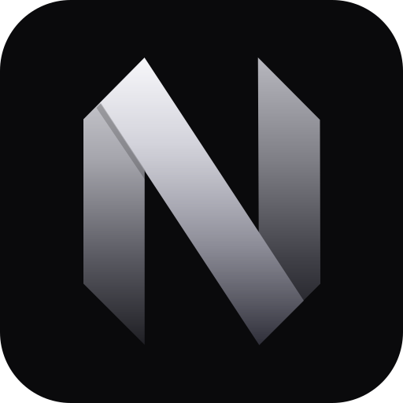

<div align="center">



# neosh

**Neovim for controlling AI agents.**

A terminal workspace where every feature is a plugin.

[Quick start](#quick-start) · [How it works](#how-it-works) · [Plugins](#plugins) · [Docs](docs/) · [Community](#community)

<br />


</div>

<br />

Run coding agents the way you run Neovim. One workspace, any model, and a public API that every
built-in feature is written on. If you can see it, a plugin can replace it.

## Quick start

```bash
git clone https://github.com/neoswarm/neosh
cd neosh
cargo run
```

No API key needed. An existing `claude` login works as is, and 423 models are reachable before you
configure anything. `cargo run -- init` writes a starter config you can edit.

## How it works

The workspace is a process. Terminals attach to it and mirror it, live. Close one, the turns keep
running, and `neosh` puts you back.

```
 plugins (TypeScript)          your init.ts is one too
        │
        ▼
 one core (Rust)               buffers, windows, agents, keys
        │
        ▼
 every terminal                attached, mirrored, detachable
```

Everything on screen came through the same API a third party plugin uses. The chat, the sidebar,
git, the palette. All defaults, and a default is something you turn off.

## Plugins

A plugin is a folder with a `plugin.toml` and a `main.ts`. Drop it in, it runs.

```ts
import type { PluginContext } from "@neosh/api";

export async function activate({ neosh }: PluginContext) {
  const buf = await neosh.buf.create({ name: "[hello]" });
  await neosh.float.open(buf, { border: "rounded", title: "hi" });
}
```

Guide: [docs/plugins.md](docs/plugins.md). Built one? Put it in the
[showcase](website/src/data/plugins/README.md). One file, one pull request.

## Configuration

Same layout Neovim uses. `~/.config/neosh/init.ts` is a plugin with the whole API, and
`config.toml` sits beside it for plain settings. See [docs/config.md](docs/config.md).

## Models

| driver | needs |
|---|---|
| `claude-cli` | your existing `claude` login |
| `anthropic` | `ANTHROPIC_API_KEY` |
| `openai-compat` | any endpoint speaking the OpenAI shape |
| `google` | `GEMINI_API_KEY` |

Adding an endpoint is a config entry, never code.

## Community

neosh is non profit and held by the people who use it. No company behind it, and not affiliated
with the Neovim project, just built in its spirit.

- [Issues](https://github.com/neoswarm/neosh/issues) for bugs
- [Pull requests](https://github.com/neoswarm/neosh/pulls) for everything else

## Development

```bash
./scripts/check.sh    # everything CI runs
```

More in [AGENTS.md](AGENTS.md) and [docs/](docs/).

## License

[MIT](LICENSE). The mark is derived from the Neovim logo by Jason Long, CC BY 3.0.
