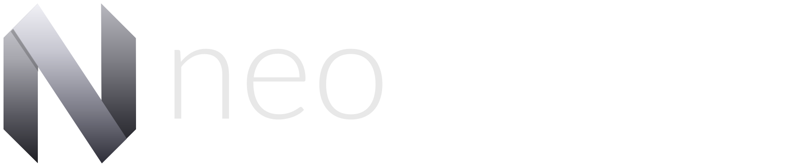
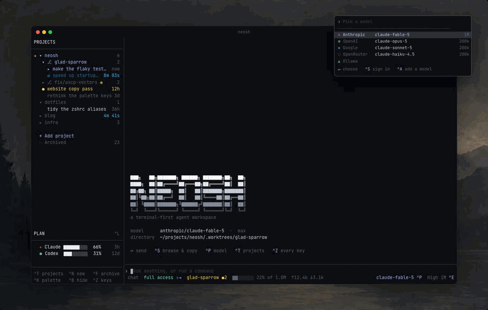
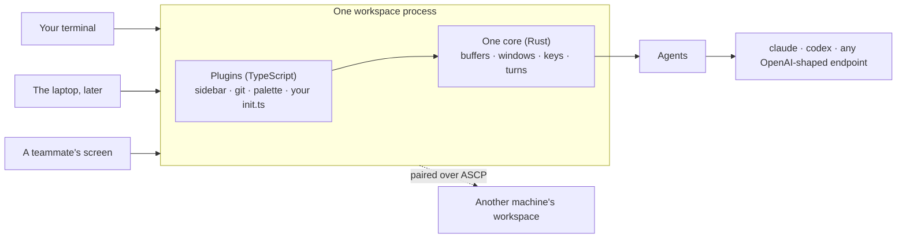

<div align="center">
  <picture>
    <source media="(prefers-color-scheme: dark)" srcset="docs/assets/logo-dark.svg">
    <source media="(prefers-color-scheme: light)" srcset="docs/assets/logo-light.svg">
    
  </picture>

  <p><b>Neovim for controlling AI agents.</b><br />A terminal workspace where every feature is a plugin.</p>

  <p>
    <a href="https://discord.gg/cWdMAqcAn5"></a>
    <a href="https://neoswarm.dev/docs"></a>
    <a href="https://github.com/neoswarm/neosh/actions/workflows/ci.yml"></a>
    <a href="./LICENSE"></a>
  </p>

  <p>
    <a href="#quick-start">Quick start</a> ·
    <a href="#how-it-works">How it works</a> ·
    <a href="#plugins">Plugins</a> ·
    <a href="#configuration">Configuration</a> ·
    <a href="https://neoswarm.dev/docs">Docs</a> ·
    <a href="#community">Community</a> ·
    <a href="#contributing">Contributing</a>
  </p>

  <p><i>⭐ A star helps more people find it. Thank you.</i></p>

  
</div>

<br />

Run coding agents the way you run Neovim. One workspace, any model, and a public API that every
built-in feature is written on. If you can see it, a plugin can replace it.

## Quick start

```bash
curl -fsSL https://neoswarm.dev/install.sh | sh
```

Or from source:

```bash
git clone https://github.com/neoswarm/neosh
cd neosh
cargo run
```

No API key needed. An existing `claude` login works as is, and 423 models are reachable before you
configure anything. `neosh init` writes a starter config you can edit. Every install option is in
the [installation guide](https://neoswarm.dev/docs/installation).

## How it works

The workspace is a process. Terminals attach to it, and each one is somewhere in it: its own
conversation, its own scroll, its own panels, while the work is shared, so every window shows
every turn that is running and where. Close one, the turns keep running, and `neosh` puts you back.



Everything on screen came through the same API a third party plugin uses. The chat, the sidebar,
git, the palette. All defaults, and a default is something you turn off.

- **One workspace, many terminals** - attach from anywhere, detach without stopping anything
- **Any model** - your `claude` login, an API key, or any OpenAI-shaped endpoint
- **Worktrees built in** - every conversation gets its own branch, named by what you asked for
- **Machines** - pair computers and steer agents that live on them, each one keeps its own files
- **Vim keys everywhere** - read the transcript in normal mode, take pieces of it out
- **Plugins in TypeScript** - fully typed API, and the built-ins are written on it too

## Plugins

A plugin is a folder with a `plugin.toml` and a `main.ts`. Drop it in, it runs.

```ts
import type { PluginContext } from "@neosh/api";

export async function activate({ neosh }: PluginContext) {
  const buf = await neosh.buf.create({ name: "[hello]" });
  await neosh.float.open(buf, { border: "rounded", title: "hi" });
}
```

Guide: [neoswarm.dev/docs/plugins](https://neoswarm.dev/docs/plugins). Writing one with an agent?
Point it at [neoswarm.dev/skill.md](https://neoswarm.dev/skill.md). Built one? Put it in the
[showcase](website/src/data/plugins/README.md). One file, one pull request.

## Configuration

Same layout Neovim uses. `~/.config/neosh/init.ts` is a plugin with the whole API, and
`config.toml` sits beside it for plain settings. See
[neoswarm.dev/docs/configuration](https://neoswarm.dev/docs/configuration).

## Models

| driver | needs |
|---|---|
| `claude-cli` | your existing `claude` login |
| `anthropic` | `ANTHROPIC_API_KEY` |
| `openai-compat` | any endpoint speaking the OpenAI shape |
| `google` | `GEMINI_API_KEY` |

Adding an endpoint is a config entry, never code.

## Documentation

The full docs live at **[neoswarm.dev/docs](https://neoswarm.dev/docs)**.

| Read this | To learn |
|-----------|----------|
| [Start guide](https://neoswarm.dev/docs) | Install, first conversation, the keys that matter |
| [Configuration](https://neoswarm.dev/docs/configuration) | `config.toml`, `init.ts`, and where everything lives |
| [Keymaps](https://neoswarm.dev/docs/keymaps) | Rebinding anything, modes, and the command palette |
| [Models](https://neoswarm.dev/docs/models) | Drivers, endpoints, and per-model options |
| [Machines](https://neoswarm.dev/docs/machines) | Pairing computers and steering remote agents |
| [Writing a plugin](https://neoswarm.dev/docs/plugins) | From empty folder to something on screen |
| [Docs for agents](https://neoswarm.dev/docs/agents) | llms.txt, the plugin skill, and what to tell your agent |

## Community

neosh is non profit and held by the people who use it. No company behind it, and not affiliated
with the Neovim project, just built in its spirit.

- **[Discord](https://discord.gg/cWdMAqcAn5)** - talk to the people building and using it
- **[GitHub Issues](https://github.com/neoswarm/neosh/issues)** - report bugs and request features
- **[Pull requests](https://github.com/neoswarm/neosh/pulls)** - for everything else

<p>
  <a href="https://discord.gg/cWdMAqcAn5"></a>
</p>

## Star the repository ⭐

A star helps more people find neosh, and it is the one metric a non profit project has.

<!-- star gif goes here -->

## Contributing

Pull requests are welcome. Keep each one to a single logical change, and open an issue first for
anything large. `./scripts/check.sh` runs everything CI runs, and for anything visual, attach a
screenshot or a short recording: it is a terminal app, so what the screen looks like is the point.
The full guide is in [CONTRIBUTING.md](CONTRIBUTING.md), and the design rules live in
[AGENTS.md](AGENTS.md) and [docs/adr/](docs/adr/).

## Security

Found a vulnerability? Report it privately through
[GitHub security advisories](https://github.com/neoswarm/neosh/security/advisories/new) instead of
opening a public issue.

## License

[MIT](LICENSE). The mark is derived from the Neovim logo by Jason Long, CC BY 3.0.
